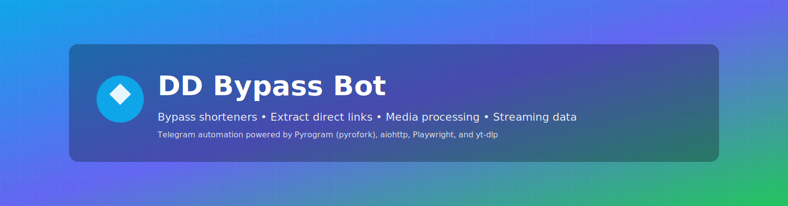

	
	
	
	
	

<strong>Powerful Telegram automation</strong> for bypassing shorteners and extracting direct links. Get usable links, metadata, and media in a single reply.

## Overview

Short links, scattered hosting pages, and manual downloads waste time. DD Bypass Bot automates link bypassing, direct-link generation, media extraction, thumbnail editing, and metadata retrieval. Send a link or media, get clean outputs back.

> Status: This repository documents the bot and its setup. Code and implementation details may evolve; site-specific scrapers often require ongoing maintenance due to frequent changes and anti-bot protections.

## Features

- Bypass shortener sites
	- Automatically resolve common shorteners into target URLs (best-effort, including Cloudflare challenges).
	- Example: `/bypass short.ly/abc123` → `https://example.com/file.zip`.

- Direct download links from sharers & file hosts
	- Convert share pages into direct-download URLs when possible.
	- Example: `/bypass sharehost.com/file/XYZ` → `https://cdn.sharehost.com/files/XYZ/download`.

- Telegram media extraction
	- Produce mediainfo, short sample clips, screenshots, and direct file links for Telegram-hosted files.
	- Example: send a video → click the action button → Mediainfo: H.264 1080p; Sample: `sample.mp4`.

- Thumbnail and cover extraction/replacement
	- Extract existing thumbnails/covers or set new ones for replied files.
	- Example: `/cover` or `/extract_thumb <reply> <image|url>` → bot replaces thumbnail and confirms.

- Direct image links
	- Generate stable direct links for images hosted on various platforms.
	- Example: `/paste <reply to photo or link>` → `https://cdn.imagepage.com/abc.jpg`.

- YouTube direct downloads (yt-dlp)
	- Produce direct downloadable streams or container links via yt-dlp.
	- Example: `/yt https://youtu.be/abc` → outputs `best-audio.mp4` and/or stream URLs.

- Streaming availability (JustWatch)
	- Lookup where a movie/series is available to stream in the configured region.
	- Example: `/ott <title>` → streaming platforms and purchase/rent options.

- Backdrops & posters (TMDB)
	- Fetch official backdrops and poster art from TMDB for titles.
	- Example: `/posters <title>` → poster (portrait) and backdrop (landscape) links.

- OTT poster scraping (best-effort)
	- Attempt to fetch posters/landscapes directly from major OTT sites (Amazon, Netflix, Zee5, SonyLiv, Apple TV, Aha, Crunchyroll, BookMyShow). Results vary by site and region.

## How it works

User messages or commands route to handler modules. Handlers invoke:

- Shortener resolver and host extractors
- Site-specific scrapers and challenge solvers
- Telegram file APIs for media processing
- yt-dlp for YouTube extraction
- TMDB and JustWatch for title data

Responses are formatted as direct links, metadata blocks, images, or edited files delivered via Telegram messages with inline previews, attachments, or edited media.

## Architecture at a glance

- Core components: shortener resolver, host extractor, Telegram media processor, yt-dlp integration, TMDB and JustWatch API clients, site-specific scrapers.
- Thumbnail extraction/replacement: Telegram file APIs + Pillow/ffmpeg.
- Anti-bot handling: combination of headless automation and specialized scraping layers (best-effort where sites enforce strict protections).

## Tech stack

- Async/runtime: uvloop, aiohttp, websockets, aiofiles
- Telegram & crypto: pyrofork (Pyrogram fork), tgcrypto, pycryptodome, cryptography
- Datastore & IO: motor (MongoDB async driver)
- Scraping & browser automation: cloudscraper, cfscrape, curl-cffi, requests, urllib3<2, playwright, lxml_html_clean, bs4
- Cloudflare/challenge handling: cloudscraper, playwright, cfscrape, curl-cffi (combined strategies)
- Media & image processing: pillow, ffmpeg (invoked via subprocess)
- YouTube extraction: yt-dlp (subprocess or wrapper)
- Third-party wrappers & helpers: simple-justwatch-python-api, pycountry, html-telegraph-poster
- Utilities & compatibility: requests/httpx patterns, urllib3 compatibility shims

## Hosting

The bot is typically hosted in Docker containers on a VPS for reliable uptime and isolated dependency management. Runtime is orchestrated via Docker with service monitoring.

## Security & privacy

- Files are not permanently stored unless explicitly configured; temporary caching is used for processing.
- Users are responsible for copyright compliance; the bot provides metadata and links only.
- API quotas and rate limits apply; aggressive usage may be throttled or blocked.

## Support & updates

- Updates channel: `@DD_Bypass_Updates`
- Bot username: `@DD_Bypass_Bot`
- Group link: see the pinned message in the updates channel.

## Credits / acknowledgements

Core libraries and tools: Pyrogram fork (pyrofork), tgcrypto, uvloop, motor, aiohttp, cloudscraper, playwright, bs4, lxml_html_clean, requests, cfscrape, curl-cffi, yt-dlp, pillow, pycryptodome, simple-justwatch-python-api, cryptography, websockets, pycountry, html-telegraph-poster.

## Legal

This project is intended for educational and personal-use automation. You are responsible for complying with the Terms of Service of the platforms you access and with applicable laws. Do not use this project to violate copyrights or bypass paywalls. TMDB, JustWatch, and other names are trademarks of their respective owners.

---

## Quick links

- ▶️ Bot: `@DD_Bypass_Bot`
- 📣 Updates: `@DD_Bypass_Updates`
- 🐞 Issues: https://github.com/murdock-dev/DD-Bypass-Bot/issues